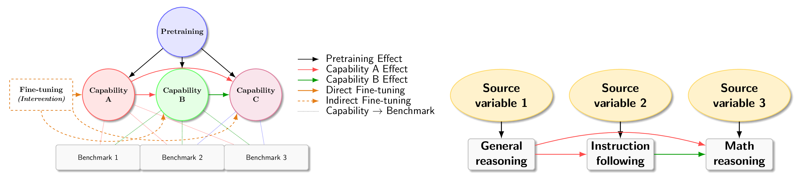

# Discovering Hierarchical Latent Capabilities of Language Models via Causal Representation Learning

## Overview

Rigorous evaluation of language-model abilities is hampered by confounding effects and the cost of repeated retraining, so we introduce a causal representation-learning framework that treats benchmark scores as a linear transformation of a few latent capability factors and explicitly controls for the base model as a shared confounder. Applying this method to performance data from more than 1,500 models on six Open LLM Leaderboard benchmarks, we uncover a concise three-node linear causal structure that consistently explains score variation. Interpreting this structure reveals a clear causal pathway: broad problem-solving skill drives instruction-following proficiency, which in turn underpins mathematical-reasoning ability. The findings highlight that controlling base-model differences is essential for faithfully exposing the true causal relations among latent capabilities and offer deeper scientific insight than numeric leaderboard rankings alone.



## Environment

### Training

```bash
curl -LsSf https://astral.sh/uv/install.sh | sh
uv venv $SCRATCH/envs/eval --python 3.11 && source $SCRATCH/envs/eval/bin/activate  && uv pip install pip
uv pip install transformers datasets torch trl
```

### Evaluation

```bash
git clone git@github.com:huggingface/lm-evaluation-harness.git
cd lm-evaluation-harness
git checkout main
uv pip install -e . vllm
uv pip install langdetect immutabledict math-verify
```

Double check https://github.com/EleutherAI/lm-evaluation-harness/pull/2772/commits/7207e4ea33df5bd6a10c872f2fac4993ea727067
envs/eval/lib/python3.11/site-packages/lm_eval/tasks/leaderboard/math/utils.py

Alternatively,

```bash
uv pip install lm_eval\[vllm\]
uv pip install langdetect immutabledict antlr4-python3-runtime==4.11
uv pip install math-verify==0.7.0
```

Then,
```bash
bash eval.sh
```

Maybe hack the vllm code to allow prompt length = max_model_len.
```python
# vllm/v1/engine/processor.py
if len(prompt_ids) > self.model_config.max_model_len:
    raise ValueError(
        f"Prompt length of {len(prompt_ids)} is longer than the "
        f"maximum model length of {self.model_config.max_model_len}.")
```

## 📁 Directory Structure

/ (Root Directory) 
│── scripts/ # Contains executable scripts (in Python) 
│── Tables/ # Stores tables, datasets, or other structured data 
│── Figures/ # Holds figures generated from our code


### 📜 Directory Details

#### 1️⃣ `scripts/`
- This folder contains scripts used for reproducing the main results of our paper
- Files:
  - `main.ipynb` – Contains the main part of our analysis, specifically the PCA/ICA for comparing the principle component spaces and HCA for identifying the latent causal factors.
  - `matrix_completion.ipynb` – Based on our observation of heterogeneous PC subspaces, we implement a local matrix completion approach that outperforms the naive global approach.
  - `find_proximal_benchmark.ipynb` - We run OLS to find out a benchmark that is best-aligned with each latent causal factor discovered by HCA. Then adjust the latent factors to improve their interpretability. The adjustment is valid due to the ambiguity shown in our main Theorem.
  - `scaling_law.ipynb` - Fit the scaling law with a treatment variable on all six benchmarks. The treatment variable is set in multiple ways e.g., whether the model is fine-tuned, or whether it is released after 2024.
  - `find_token_size.ipynb` - Map each model in the leaderboard to a base model based on publicly available information.
  - `subgroup_pca.ipynb` - Plot the cosine distances between PC subspaces for different definitions of model subgroups.
  - `plot_causal_graph.ipynb` - Plot the exact v.s. inexact structural causal models (SCM).
  - `Qwen_illustrate.ipynb` - Compare the performance of models that use Qwen2.5 pretrained models with different sizes as base model.
  - `utils_full.py` - Contains the implemention of various algorithms/functions that are used in the `.ipynb` files.
  - `plot_illustrate_full.py` - Contains the implementation of the PCA analyses.

#### 2️⃣ `Tables/`
- Stores tables that are used in our analysis
- Files:
  - `open_llm_leaderboard.csv` – Detailed information of the new open LLM leaderboard. Can be directly loaded from an url link in `main.ipynb`.
  - `open_llm_leaderboard_with_tokens.csv` – Leaderboard with information about the models' pretraining token sizes and base models, obtained by running `find_token_size.ipynb`.
  - `open_llm_leaderboard_with_tokens_filter_bad_models.csv` - We filter out all "badly fine-tuned" models (models with worse average performance than their base models).
  - `open_llm_leaderboard_old.csv` and `open_llm_leaderboard_old_with_tokens.csv` - Dta for the old version of the leaderboard.
  - `MMLU-by-task-Leaderboard.csv` contains the accuracy of models on each category of the MMLU benchmark.

## 🚀 Usage Instructions
- Simply run all the scripts in the `scripts/` folder to reproduce the results.
- Check the `Tables/` folder for processed data.
- Store all figures in the `Figures/` directory.

## Cite as

```
@inproceedings{
      jin2025crl,
      title={Discovering Hierarchical Latent Capabilities of Language Models via Causal Representation Learning},
      author={Jikai Jin, Vasilis Syrgkanis, Sham M. Kakade, Hanlin Zhang},
      booktitle={arxiv},
      year={2025},
}
```